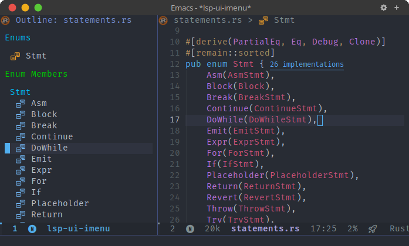

<div align="center">

# modern-icons-lsp.el

Modern icons for Emacs [lsp-mode](https://github.com/emacs-lsp/lsp-mode).

</div>

This library integrates [modern-icons.el](https://github.com/emacs-modern-icons/modern-icons.el) to display modern and pretty SVG icons for [lsp-mode](https://github.com/emacs-lsp/lsp-mode) completion results in Emacs.

## Installation

Install from Melpa (supported soon) or manually using [straight.el](https://github.com/radian-software/straight.el) like below:

```elisp
(use-package modern-icons
  :straight (modern-icons :type git :host github
                          :repo "emacs-modern-icons/modern-icons-lsp.el"))
```

## Usage

Include the following code into your configuration file:

```elisp
(require 'modern-icons-lsp)
(modern-icons-lsp-enable)
```

## Screenshots

- lsp-ui-imenu:

  <p align="center">
    
  </p>
